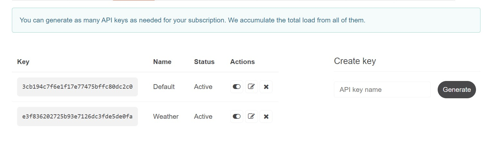
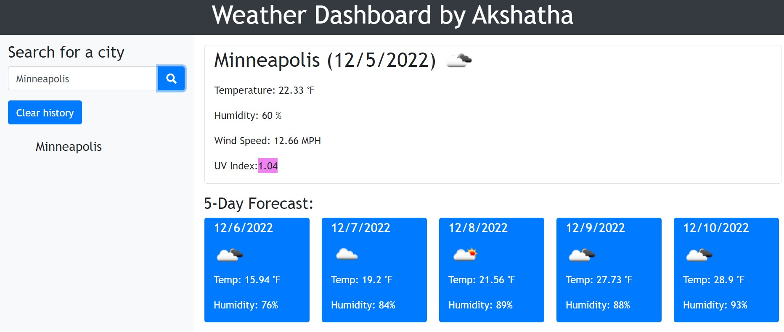

User Story

AS A traveler

I WANT to see the weather outlook for multiple cities

SO THAT I can plan a trip accordingly

Acceptance Criteria
GIVEN a weather dashboard with form inputs

WHEN I search for a city

THEN I am presented with current and future conditions for that city and that city is added to the search history

WHEN I view current weather conditions for that city

THEN I am presented with the city name, the date, an icon representation of weather conditions, the temperature, the humidity, and the the wind speed

WHEN I view future weather conditions for that city

THEN I am presented with a 5-day forecast that displays the date, an icon representation of weather conditions, the temperature, the wind speed, and the humidity

WHEN I click on a city in the search history

THEN I am again presented with current and future conditions for that city

Mock-Up

The following image shows the web application's appearance and functionality:

Work Done:

* After a HTML doc is created I started to work on JAVASCRIPT and then I created an event listener for the 'search' button was created in order to initiate a function that captures what the user entered, and then use that input in order to utilize the weather API

* Also worked on storing the input from the user into local storage

*Generated API Keys from openweathermap and also using 2 APIs here to obtain current and weather for 5 day weather

* Faced issue while getting the data for the current weather, so followed same way where we are getting a 5 day weather but instead of getting the data we want and displaying it within the fetch, I actually called a new function and pass to it the data I want 

*For UV Index, we need to call a separate API. So, from the current weather data, we need to get the latitude and longitude values of that city, and then call the function getUV in order to get the actual UV index and also highlights color

* To display the search history and allow this city history list to be clickable I created a function which will be done in all one condition

* And also added an event listener for the clear history button 

*Website looks like below

Resources

https://openweathermap.org/forecast5 - Generated a API Key

https://cdnjs.cloudflare.com/

https://coding-boot-camp.github.io/full-stack/apis/how-to-use-api-keys

https://www.w3schools.com/jsref/met_document_createelement.asp - CreateElement

https://www.geeksforgeeks.org/how-to-create-an-image-element-dynamically-using-javascript/ - How to create an image element

https://blog.apilayer.com/weather-forecast-api-expectations-vs-reality/

https://momentjs.com/docs/#/displaying/ - Moment JS

https://getbootstrap.com/docs/5.0/layout/containers/ - Bootstrap Containers

https://getbootstrap.com/docs/5.0/forms/overview/ - Bootstrap Forms

https://developer.mozilla.org/en-US/docs/Learn/JavaScript/Client-side_web_APIs/Fetching_data - How to fetch data from Server

https://developer.mozilla.org/en-US/docs/Learn/JavaScript/Client-side_web_APIs/Manipulating_documents - How to manipulate documents

